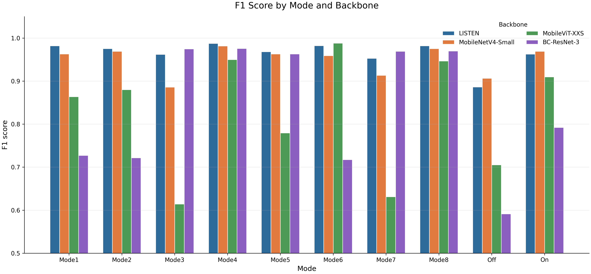
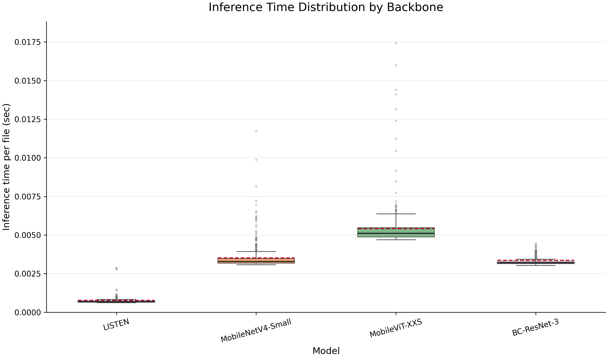

# LISTEN

**LISTEN: Lightweight Industrial Sound-representable Transformer for Edge Notification**

This repository contains downstream adaptation and evaluation code for LISTEN, a lightweight industrial sound foundation model designed for edge-device machine monitoring. LISTEN is distilled from the industrial sound teacher model IMPACT and is used as a frozen acoustic backbone; only a shallow classifier head is trained for a new target process.

## Paper

- Main article: [Advanced Engineering Informatics, 76, 104944](https://doi.org/10.1016/j.aei.2026.104944)
- Alternative preprint: [arXiv:2507.07879](https://arxiv.org/abs/2507.07879)

The paper reports that LISTEN reduces the teacher model from O'IMPACT's 4.23M parameters to a 0.07M-parameter encoder, while preserving industrial acoustic representation quality and enabling real-time inference on a Raspberry Pi 4. In the on-site CNC validation, the LISTEN backbone is frozen and a shallow MLP head is adapted from minimal single-trial data for ten operational modes.

## Data Availability

The pretraining dataset, **DINOS (Diverse INdustrial Operation Sounds)**, is sourced from [hanprd/DINOS](https://github.com/hanprd/DINOS). DINOS is currently under revision and will be available through that repository.

The `Datasets/` folder in this repository contains the on-site CNC downstream data used for rapid adaptation and inference validation, not the full DINOS pretraining corpus.

Compared with the dataset snapshot used in the paper experiments, the current `Datasets/` folder includes additional downstream samples. As a result, metrics reproduced from this repository may differ from the paper values unless the original paper snapshot is used.

## Repository Structure

```text
.
|-- LISTEN_train_downstream.py      # Train a shallow classifier on a frozen backbone
|-- LISTEN_test_downstream.py       # Run wav-file inference and save metrics
|-- Visualization.py                # Generate plots from inference logs
|-- requirements.txt
|-- Datasets/
|   |-- Onsite_Train/
|   |   |-- train_list.csv
|   |   `-- Mode1 ... Mode8, Off, On/
|   `-- Onsite_Test/
|       `-- test/
|           `-- Mode1 ... Mode8, Off, On/
|-- Models/
|   |-- LISTEN.pth
|   |-- LISTEN-classifier.pth
|   |-- MobileNetV4-Small.pth
|   |-- MobileNetV4-Small-classifier.pth
|   |-- MobileViT-XXS.pth
|   |-- MobileViT-XXS-classifier.pth
|   |-- BC-ResNet-3.pth
|   `-- BC-ResNet-3-classifier.pth
`-- Logs/
    |-- *_inference_log_*.csv
    |-- *_class_metrics.csv
    `-- Visualizations/
```

## Installation

Use Python 3.10 or newer. The scripts automatically select `mps`, `cuda`, or `cpu`, depending on the available device.

```bash
git clone https://github.com/hanprd/LISTEN.git
cd LISTEN

python -m venv venv
source venv/bin/activate
pip install -r requirements.txt
```

Run all commands from the repository root because `Datasets/Onsite_Train/train_list.csv` stores relative audio paths.

## Included Backbones

| `--backbone` | Type | Encoder checkpoint | Classifier checkpoint |
|---|---:|---|---|
| `LISTEN` | Lightweight encoder | `Models/LISTEN.pth` | `Models/LISTEN-classifier.pth` |
| `MobileNetV4-Small` | Benchmark baseline | `Models/MobileNetV4-Small.pth` | `Models/MobileNetV4-Small-classifier.pth` |
| `MobileViT-XXS` | Benchmark baseline | `Models/MobileViT-XXS.pth` | `Models/MobileViT-XXS-classifier.pth` |
| `BC-ResNet-3` | Benchmark baseline | `Models/BC-ResNet-3.pth` | `Models/BC-ResNet-3-classifier.pth` |

## Dataset Format

Training uses a CSV manifest with the following columns:

```csv
filepath,start_sample,label,class_name
Datasets/Onsite_Train/On/audio_20250702_154817_34.wav,0,1,On
```

- `filepath`: path to a wav file, relative to the repository root or absolute
- `start_sample`: starting sample index for the one-second clip
- `label`: numeric class label in the original manifest
- `class_name`: class folder/name used by the scripts

The preprocessing pipeline expects 48 kHz wav audio. Each one-second clip is converted to a `1 x 128 x 128` log-Mel spectrogram using a 2048-point FFT, 2048-sample window length, 376-sample hop length, 128 Mel bands, and `top_db=80`.

## Train a Downstream Classifier

The backbone is frozen and only the MLP classifier head is trained. By default, training uses `Datasets/Onsite_Train/train_list.csv`, runs for 200 epochs, and saves a timestamped log under `Logs/`.

```bash
python LISTEN_train_downstream.py
```

Optional paths:

```bash
python LISTEN_train_downstream.py \
  --backbone LISTEN \
  --csv-path Datasets/Onsite_Train/train_list.csv \
  --encoder-path Models/LISTEN.pth \
  --classifier-path Models/LISTEN-classifier.pth
```

Valid backbone names are `LISTEN`, `MobileNetV4-Small`, `MobileViT-XXS`, and `BC-ResNet-3`.

## Run Inference

Inference recursively scans the test directory for `.wav` files, predicts a class for each file, and writes both per-file predictions and class-level metrics to `Logs/`.

```bash
python LISTEN_test_downstream.py
```

Optional paths:

```bash
python LISTEN_test_downstream.py \
  --backbone LISTEN \
  --test-dir Datasets/Onsite_Test/test \
  --train-csv Datasets/Onsite_Train/train_list.csv \
  --encoder Models/LISTEN.pth \
  --classifier Models/LISTEN-classifier.pth \
  --output-csv Logs/LISTEN_inference.csv \
  --metrics-csv Logs/LISTEN_class_metrics.csv
```

The test script uses folder names under `Datasets/Onsite_Test/test/` as true labels when computing class metrics.

## Visualize Results

```bash
python Visualization.py
```

This generates:

- `Logs/Visualizations/f1_by_mode.png`
- `Logs/Visualizations/inference_time_boxplot.png`





## Paper Benchmark Summary

The Advanced Engineering Informatics paper reports the following encoder-level comparison on a Raspberry Pi 4:

| Model | Parameters | MACs | Time (ms per sample) | CPU (%) / Memory (MB) | F1 Score ColdSpray | F1 Score Renishaw | F1 Score Yornew | F1 Score VF2 |
|---|---:|---:|---:|---:|---:|---:|---:|---:|
| IMPACT | 17.3M | 291.3M | 179 | 86 / 454 | 0.919 | 1.000 | 0.900 | 0.952 |
| O'IMPACT | 4.23M | 71.3M | 92 | 77 / 394 | 0.941 | 1.000 | 0.891 | 0.955 |
| MobileNetV4-S | 1.45M | 60.32M | 78 | 82 / 386 | 0.909 | 1.000 | 0.906 | 0.957 |
| MobileViT-XXS | 0.76M | 65.67M | 190 | 61 / 402 | 0.936 | 1.000 | 0.900 | 0.949 |
| BC-ResNet-3 | 0.08M | 47.06M | 149 | 87 / 406 | 0.918 | 1.000 | 0.876 | 0.946 |
| LISTEN | 0.07M | 5.24M | 32 | 66 / 364 | 0.934 | 1.000 | 0.907 | 0.956 |

In the on-site CNC case study, LISTEN was adapted with approximately 20 seconds of data per operational mode, completed 200 epochs of shallow-head training in 61 seconds, and achieved an overall F1-score of 0.938 while meeting the 33.3 ms real-time processing threshold on average.

## Citation

If you find our LISTEN codes and models useful in your work, please consider citing our paper:

```bibtex
@article{HAN2026104944,
  title = {{LISTEN}: {L}ightweight {I}ndustrial {S}ound-representable {T}ransformer for {E}dge {N}otification},
  journal = {Advanced Engineering Informatics},
  volume = {76},
  pages = {104944},
  year = {2026},
  issn = {1474-0346},
  doi = {10.1016/j.aei.2026.104944},
  author = {Changheon Han and Yun Seok Kang and Yuseop Sim and Hyung Wook Park and Martin Byung-Guk Jun}
}
```
